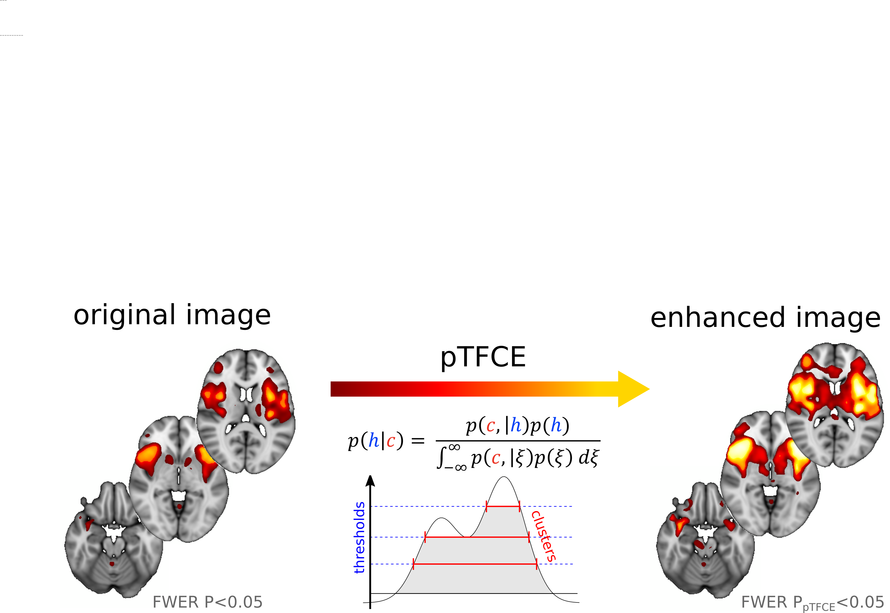

# pTFCE: probabilistic Treshold-free Cluster Enhancement 

### Version: 0.1.0

For more information, check out the [project pages](https://spisakt.github.io/pTFCE/)!

For a detailed description and theory, please refer to (and please cite):

> _Tamás Spisák, Zsófia Spisák, Matthias Zunhammer, Ulrike Bingel, Stephen Smith, Thomas Nichols, Tamás Kincses, Probabilistic TFCE: a generalised combination of cluster size and voxel intensity to increase statistical power. Neuroimage, 185:12-26. [DOI: 10.1016/j.neuroimage.2018.09.078_](https://doi.org/10.1016/j.neuroimage.2018.09.078)

