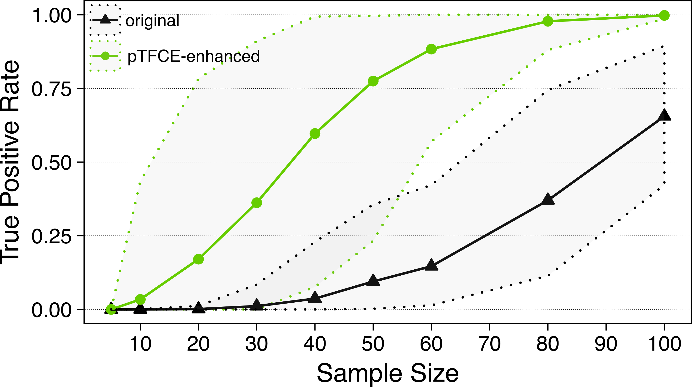

# Probabilistic Treshold-free Cluster Enhancement 

Welcome to the [wiki](https://spisakt.github.io/pTFCE/) pages of pTFCE!

pTFCE (probabilistic TFCE) is a cluster-enahncement method to improve detectability of neuroimaging signal.
It performs topology-based belief boosting by integrating cluster information into voxel-wise statistical inference.

**Figure 1.** pTFCE achieves a significant increase in statistical power in most of the typical fMRI processing scenarios.
See the [paper](https://doi.org/10.1016/j.neuroimage.2018.09.078) for details.

For a detailed description and theory, please refer to (and please cite):

> _Tamás Spisák, Zsófia Spisák, Matthias Zunhammer, Ulrike Bingel, Stephen Smith, Thomas Nichols, Tamás Kincses, Probabilistic **TFCE: a generalised combination of cluster size and voxel intensity to increase statistical power.** Neuroimage, 185:12-26._

## :arrow_down: Download
 [R-package](https://github.com/spisakt/pTFCE/releases) & [Installation](https://github.com/spisakt/pTFCE/wiki/3.-R-package) **NEW RELEASE** :new: smoothness estimation based on [4D residual data](https://github.com/spisakt/pTFCE/wiki/Some-important-notes-on-smoothness-estimation) 
 
 [SPM Matlab Toolbox](https://github.com/spisakt/pTFCE_spm/releases) & [Installation](https://github.com/spisakt/pTFCE/wiki/4.-SPM-Toolbox)

## Contents
1. [Overview](https://github.com/spisakt/pTFCE/wiki/1.-Overview)
2. [Relation to TFCE](https://github.com/spisakt/pTFCE/wiki/2.-Relation-to-TFCE)
3. [The R-package](https://github.com/spisakt/pTFCE/wiki/3.-R-package) 

   3.1 [Installation](https://github.com/spisakt/pTFCE/wiki/3.-R-package) 
   3.2 [Usage](https://github.com/spisakt/pTFCE/wiki/3.-R-package)
4. [The SPM Toolbox](https://github.com/spisakt/pTFCE/wiki/4.-SPM-Toolbox) 

   4.1 [Installation](https://github.com/spisakt/pTFCE/wiki/4.-SPM-Toolbox)  
   4.2 [Usage](https://github.com/spisakt/pTFCE/wiki/4.-SPM-Toolbox)
5. [The FSL extension](https://github.com/spisakt/pTFCE/wiki/5.-FSL-extension) 
   5.1 [Installation](https://github.com/spisakt/pTFCE/wiki/5.-FSL-extension) 
   5.2 [Usage](https://github.com/spisakt/pTFCE/wiki/5.-FSL-extension)
6. [The Nipype interface](https://github.com/spisakt/pTFCE/wiki/6.-Nipype-Interface)  
[Citation and References](https://github.com/spisakt/pTFCE/wiki/Citation-&-References)

**Figure 2.** A graphical representation of pTFCE depicting the integaration of cluster probabilities at various cluster-forming threshold via Bayes' Theorem and our incremental probability aggregation technique.

